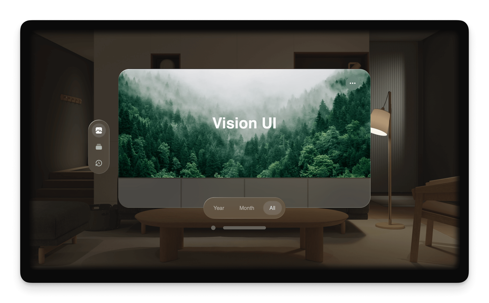

# Vision-OS

<!-- -->

Website with design similar to what you see inside an Apple's Vision Pro. Created using Framer Motion, Nextjs, TailwindCSS and Shadcn!!
Hosted at https://vision-os.xyz and https://vos.theme-verse.com!


⚠️ **Warning:** The current commits are working fine in development mode but due to a plugin it is throwing an error in production. **Working on the fix currently**. Production will be updated soon!


## **Things to note**
- Changes are under progress and more things will be added to this including **images, icons, camera option and maybe games!**.
- Most of the work in this repository is of [Oliver Pan](https://github.com/fluid-design-io/)  and I am just trying to make it better by adding more features in it. 

## Components Usage
This components are made in Framer Motion and are 100% customizable. Dedicated documentation is in progress and will be added soon. Currently you can use or see the components in the `components/core` folder.
The major components are Button, Cursor, Dropdown Menu, Input, Hoverable, List, Navigation Bar, Ornament, Sidebar, Text Effect, Toolbar, Window and View Component. 

## Running in development mode!

Note that running this in development mode might throw some errors which you will need to fix manually after installing the required packages `due to additional updates`
To run this in development mode, do the following steps:

```bash
# Clone the repository
git clone https://github.com/Hackclub-OC/vision-os.git

# Go into the repository
cd vision-os

# Install dependencies 
npm install # you can use any preffered package manager

# Rename the .evn.example to .env.local
mv .env.example .env.local

# Run the development server
npm run dev

## And you are in development mode at localhost!
```

